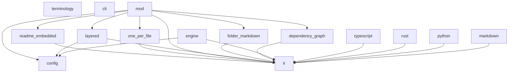

## Dependency Graph

## Modules

### `cli`

**File**: src/cli.rs

**Contents**: 1 structs, 0 functions

**Key Types and Functions**:

- `Cli` (struct)

**Dependencies**: clap

### `config`

**File**: src/config.rs

**Contents**: 2 structs, 0 functions

**Key Types and Functions**:

- `Config` (struct)
- `Layer` (struct)

**Dependencies**: anyhow, serde, std, toml

### `markdown`

**File**: src/drivers/markdown.rs

**Contents**: 1 structs, 0 functions

**Key Types and Functions**:

- `MarkdownDriver` (struct)

**Dependencies**: anyhow, ir, layouts, std, super

### `python`

**File**: src/drivers/python.rs

**Contents**: 1 structs, 0 functions

**Key Types and Functions**:

- `PythonDriver` (struct)

**Dependencies**: anyhow, drivers, ir, super

### `rust`

**File**: src/drivers/rust.rs

**Contents**: 1 structs, 0 functions

**Key Types and Functions**:

- `RustDriver` (struct)

**Dependencies**: anyhow, drivers, ir, std, super, tree_sitter

### `terminology`

**File**: src/drivers/terminology.rs

**Contents**: 1 structs, 0 functions

**Key Types and Functions**:

- `LanguageTerminology` (struct)

### `typescript`

**File**: src/drivers/typescript.rs

**Contents**: 1 structs, 0 functions

**Key Types and Functions**:

- `TypeScriptDriver` (struct)

**Dependencies**: anyhow, drivers, ir, super

### `engine`

**File**: src/engine.rs

**Contents**: 1 structs, 0 functions

**Key Types and Functions**:

- `SyncEngine` (struct)

**Dependencies**: anyhow, config, discovery, drivers, ir, layouts, notify_debouncer_mini, rayon,
serde_json, std, tracing

### `ir`

**File**: src/ir.rs

**Contents**: 9 structs, 0 functions

**Key Types and Functions**:

- `Blueprint` (struct)
- `Module` (struct)
- `Class` (struct)
- `Function` (struct)
- `Method` (struct)
- `Property` (struct)
- `Signature` (struct)
- `Parameter` (struct)
- `Documentation` (struct)

**Dependencies**: serde, std

### `dependency_graph`

**File**: src/layouts/dependency_graph.rs

**Contents**: 1 structs, 0 functions

**Key Types and Functions**:

- `DependencyGraphLayout` (struct)

**Dependencies**: anyhow, ir, petgraph, std, super

### `folder_markdown`

**File**: src/layouts/folder_markdown.rs

**Contents**: 1 structs, 0 functions

**Key Types and Functions**:

- `FolderMarkdownLayout` (struct)

**Dependencies**: anyhow, ir, std, super

### `layered`

**File**: src/layouts/layered.rs

**Contents**: 1 structs, 0 functions

**Key Types and Functions**:

- `LayeredLayout` (struct)

**Dependencies**: anyhow, config, glob, ir, std, super

### `mod`

**File**: src/layouts/mod.rs

**Contents**: 3 structs, 0 functions

**Key Types and Functions**:

- `CustomLayoutConfig` (struct)
- `TemplateConfig` (struct)
- `CustomLayout` (struct)

**Dependencies**: anyhow, config, dependency_graph, folder_markdown, ir, layered, one_per_file,
readme_embedded, serde, std

### `one_per_file`

**File**: src/layouts/one_per_file.rs

**Contents**: 1 structs, 0 functions

**Key Types and Functions**:

- `OnePerFileLayout` (struct)

**Dependencies**: anyhow, ir, super

### `readme_embedded`

**File**: src/layouts/readme_embedded.rs

**Contents**: 1 structs, 0 functions

**Key Types and Functions**:

- `ReadmeEmbeddedLayout` (struct)

**Dependencies**: anyhow, ir, std, super

✅ No circular dependencies detected.
