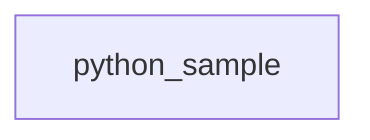

## Dependency Graph

## Modules

### `python_sample`

**File**: examples/python_sample.py

**Contents**: 2 classes, 1 defs

**Key classes and defs**:

- `User` (class)
- `Admin` (class)
- `helper()` (def)

**Dependencies**: User, dataclasses, typing

✅ No circular dependencies detected.