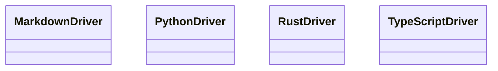

# drivers

> Language: **rust**

## Files

- `src/drivers/markdown.rs`
- `src/drivers/python.rs`
- `src/drivers/rust.rs`
- `src/drivers/typescript.rs`

---

## Classes & Functions

```mermaid
classDiagram
    %% File: src/drivers/markdown.rs
    class MarkdownDriver {
    }
    %% File: src/drivers/python.rs
    class PythonDriver {
    }
    %% File: src/drivers/rust.rs
    class RustDriver {
    }
    %% File: src/drivers/typescript.rs
    class TypeScriptDriver {
    }
```

