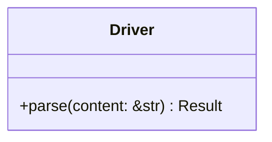

# drivers

> Language: **rust**

## Files

- `src/drivers/mod.rs`

---

## Classes & Functions

```mermaid
classDiagram
    %% File: src/drivers/mod.rs
    class Driver {
        +parse(content: &str) Result<Blueprint, String>
    }
```

