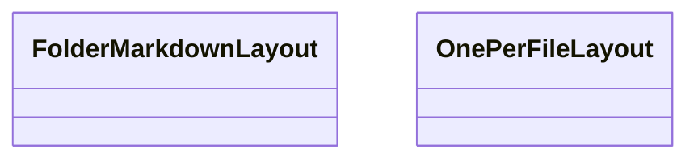

# layouts

> Language: **rust**

## Files

- `src/layouts/folder_markdown.rs`
- `src/layouts/one_per_file.rs`

---

## Classes & Functions

```mermaid
classDiagram
    %% File: src/layouts/folder_markdown.rs
    class FolderMarkdownLayout {
    }
    %% File: src/layouts/one_per_file.rs
    class OnePerFileLayout {
    }
```

