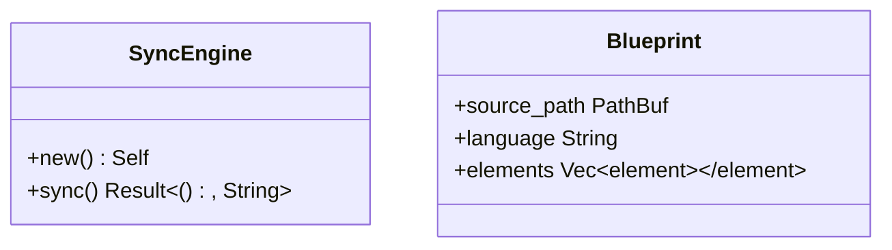

# src

> Language: **rust**

## Files

- `src/engine.rs`
- `src/ir.rs`

---

## Classes & Functions

```mermaid
classDiagram
    %% File: src/engine.rs
    class SyncEngine {
        +new() Self
        +sync() Result<(), String>
    }
    %% File: src/ir.rs
    class Blueprint {
        +source_path PathBuf
        +language String
        +elements Vec<Element>
    }
```

