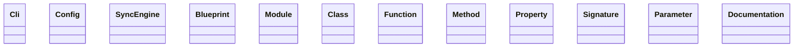

# src

> Language: **rust**

## Files

- `src/cli.rs`
- `src/config.rs`
- `src/engine.rs`
- `src/ir.rs`

---

## Classes & Functions

```mermaid
classDiagram
    %% File: src/cli.rs
    class Cli {
    }
    %% File: src/config.rs
    class Config {
    }
    %% File: src/engine.rs
    class SyncEngine {
    }
    %% File: src/ir.rs
    class Blueprint {
    }
    class Module {
    }
    class Class {
    }
    class Function {
    }
    class Method {
    }
    class Property {
    }
    class Signature {
    }
    class Parameter {
    }
    class Documentation {
    }
```

